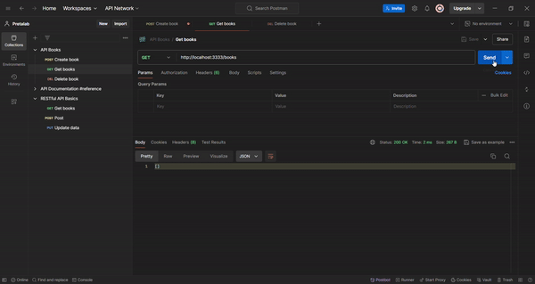
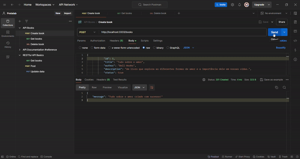
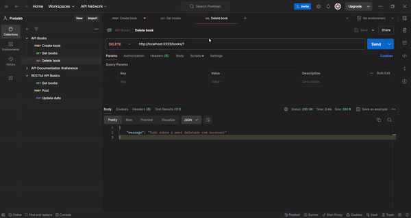

# 📚 API de Livros com Express.js

Bem-vindes à API de Livros! 🚀 Este é um projeto simples usando Node.js e Express.js para gerenciar uma lista de livros. Vamos explorar como tudo isso funciona enquanto criamos, lemos, atualizamos(TO-DO)e deletamos livros. 🎉

## 🎯 O que você vai encontrar aqui

- **Rotas RESTful**: Gerencie seus livros usando GET, POST e DELETE.
- **Express.js**: Criação de rotas de forma rápida e intuitiva.
- **CORS**: Permite que seu front-end interaja com a API de qualquer lugar do mundo. 🌍

## 🚀 Como rodar o projeto?

1. **Clone o repositório**: 
   ```bash
   git clone https://github.com/omahin/API-Book
   ```

2. **Instale as dependências**:
   ```bash
   npm install
   ```

3. **Inicie o servidor**:
   ```bash
   npm start
   ```
   O servidor estará disponível em `http://localhost:3333`. 🌐

## 📚 Como usar a API?

Aqui estão as rotas disponíveis para começar a gerenciar seus livros:

### 📖 **GET /books**
Retorna todos os livros da lista.

```json
[
  {
    "id": 1,
    "title": "Tudo sobre o amor",
    "description": "Um livro incrível sobre o amor",
    "status": true
  }
]
```

### ✍️ **POST /books**
Adiciona um novo livro à lista.

**Exemplo de corpo da requisição:**
```json
{
  "id": 1,
  "title": "Tudo sobre o amor",
  "description": "Um livro incrível sobre o amor",
  "status": true
}
```

**Resposta de sucesso:**
```json
{
  "message": "Tudo sobre o amor criado com sucesso!"
}
```

### 🗑️ **DELETE /books/:id**
Remove um livro pelo `id`.

**Resposta de sucesso:**
```json
{
  "message": "Tudo sobre o amor deletado com sucesso!"
}
```

**Resposta de erro (caso o ID não seja encontrado):**
```json
{
  "message": "Livro não encontrado!"
}
```

## 📬 Exemplo de uso no Insomnia/Postman

Aqui estão alguns exemplos de uso da API testados no Postman:

- **GET**: Listando todos os livros.
  

- **POST**: Adicionando um novo livro com sucesso.
  

- **DELETE**: Removendo um livro pelo ID.
  

## 🛠️ Tecnologias utilizadas

- **Node.js**: Motor para rodar o JavaScript no servidor.
- **Express.js**: Framework para gerenciar rotas e middleware.
- **CORS**: Permite a interação com o front-end de diferentes origens.

## 💬 Entre em contato!

Gostou do projeto? Ficou com alguma dúvida? Entre em contato! 📧

---

Divirta-se, assim como eu, explorando e personalizando sua própria lista de livros! 📚✨
